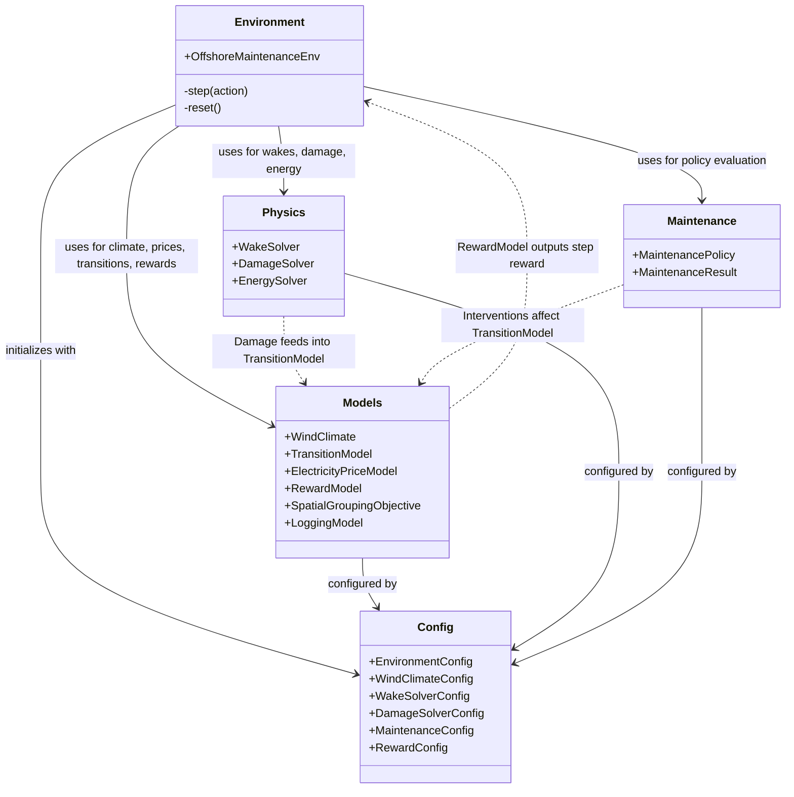

# Whisper Env

## Overview

Whisper Env is a modular Gymnasium environment for Offshore Wind Turbine Blade Maintenance addressing the Green Paradox (balancing structural blade degradation $J_{damage}$ against carbon/spatial vessel logistics $J_{spatial}$).

## Key Scientific Features

- **Deterministic Stratified Sampling:** The simulation strictly uses deterministic joint-probability Stratified Sampling to eliminate Jensen's inequality bias in expected fatigue damage. Random sampling (e.g., `rng.choice`) for fatigue aggregation is strictly prohibited. By integrating over discrete probability strata instead of relying on limited random samples, the simulation ensures mathematical stability and accuracy in accumulated damage and power outputs.
- **Pluggable Climate Presets:** The environment supports pluggable climate presets (`north_sea`, `us_atlantic`, `taiwan_strait`) for various operating conditions.
- **Hierarchical RL (HRL):** Weather Oracle hooks support providing isolated statistical weather predictors as observation feature extractors for top-level agents.

## Installation

Whisper Env must be installed locally via pip:

```bash
git clone <repository_url>
cd <repository_directory>
pip install -e .
```

The package manages dependencies such as `gymnasium`, `py_wake`, `numpy`, `pandas`, and `xarray` through `pyproject.toml`. Note that testing and execution require this local installation.

## End-to-End Experiment Pipeline

To reproduce the experiments, follow this exact 3-step workflow:

1. **Train Pareto agents:**
   ```bash
   python scripts/train_ppo_pareto.py --timesteps 50000 --seed 42
   ```

2. **Benchmark evaluation:**
   ```bash
   python scripts/benchmark_pareto.py --seed 42
   ```

3. **Generate Q1 publication plots (300 DPI):**
   ```bash
   python scripts/plot_publication.py --format both
   ```

## Running Tests

Unit tests are managed via `pytest`. To run the test suite:

```bash
python3 -m pytest tests/
```

## Usage

Here is a quick example of how to initiate the environment with the default configuration:

```python
from whisper_env import EnvironmentConfig, OffshoreMaintenanceEnv

# Initialize with default configuration
config = EnvironmentConfig()
env = OffshoreMaintenanceEnv(config)

# Reset the environment to get initial observation and info
obs, info = env.reset()
```

## Architecture & Module Interaction

The following Mermaid diagram visualizes the interaction between the core modules within the `whisper_env` package.

*Note: While `rewards.py` might be expected, reward and objective logic are modularized within `models.py` (e.g., `RewardModel`, `SpatialGroupingObjective`) and `config.py`.*



## Running Tests

Unit tests are managed via `pytest`. To run the test suite:

```bash
python3 -m pytest tests/
```
