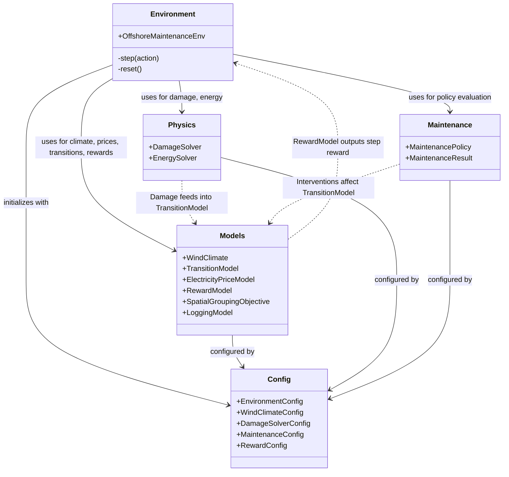

# WHISPER-RL: Wind turbine Health-Index & Spatial Policy Environment for Reinforcement Learning

## Introduction

WHISPER-RL (Wind turbine Health-Index & Spatial Policy Environment for Reinforcement Learning) is a modular Gymnasium environment for modeling Offshore Wind Turbine Blade Maintenance. The framework focuses on addressing the "Green Paradox", balancing composite blade structural fatigue (Health-Index proxy) against carbon-intensive marine vessel logistics (Spatial Policy).

## Key Methodology

- **Deterministic Stratified Sampling:** The simulation strictly uses deterministic joint-probability Stratified Sampling (Quasi-Monte Carlo numerical scheme, $m \approx 10$) to eliminate Jensen's inequality bias in expected fatigue damage.
- **Multi-Objective Formulation:** Dimensionless trade-off between blade degradation ($J_{damage}$) and spatial vessel routing compactness ($J_{spatial}$).
- **Pluggable Climate Presets:** The environment supports pluggable climate presets for various operating conditions, including North Sea, US Atlantic, and Taiwan Strait.
- **Weather Oracle:** Maintenance window accessibility probability hooks support providing isolated statistical weather predictors as observation feature extractors for future Hierarchical RL expansions.

## Architecture



## Installation

WHISPER-RL must be installed locally via pip:

```bash
git clone <repository_url>
cd <repository_directory>
pip install -e .
```

The package manages dependencies such as `gymnasium`, `numpy`, `pandas`, `xarray`, `stable-baselines3`, and `seaborn` through `pyproject.toml`. Note that testing and execution require this local installation.

## Reproducible Experiment Workflow

To reproduce the experiments, follow this exact 3-step workflow:

1. **Train Pareto agents:**
   ```bash
   python scripts/train_ppo_pareto.py --timesteps 50000 --seed 42
   ```

2. **Benchmark evaluation:**
   ```bash
   python scripts/benchmark_pareto.py --seed 42
   ```

3. **Generate Q1 publication plots (300 DPI):**
   ```bash
   python scripts/plot_publication.py --format both
   ```

## Limitations & Assumptions

The framework is built with the following modeling assumptions and technical limitations:
- **Linear Scalarization Convexity Assumption:** The multi-objective formulation utilizes linear scalarization, which assumes a convex Pareto front.
- **Euclidean Proxy Nature of Vessel Distances:** Vessel spatial routing compactness is modeled using a Euclidean distance proxy, rather than exhaustive pathfinding or graph-based constraints.
- **Computational Trade-off of Numerical Stratification:** The deterministic stratified sampling scheme enhances numerical stability, but at a computational cost, limiting the speed of step execution compared to purely random sampling approximations.
