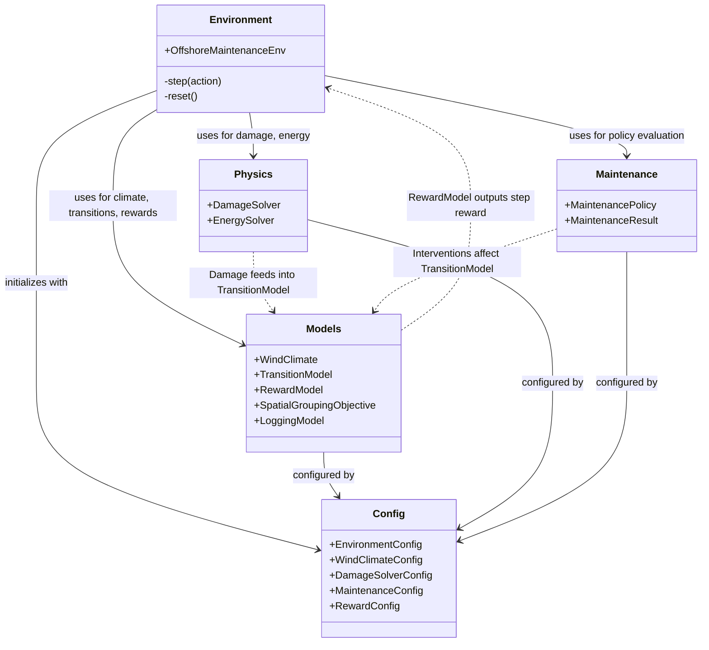

# WHISPER-RL: Wind turbine Health-Index & Spatial Policy Environment for Reinforcement Learning

[](https://gymnasium.farama.org/)
[](https://www.python.org/downloads/)
[](LICENSE)

## Introduction & Core Concept

**WHISPER-RL** (Wind turbine Health-Index & Spatial Policy Environment for Reinforcement Learning) is a specialized modular Gymnasium environment for modeling multi-objective offshore wind turbine blade maintenance strategies. The environment models a centralized single-agent controlling a wind farm of **25 offshore wind turbines** over a multi-decade operational lifetime.

The core objective is resolving the **"Green Paradox"** in offshore wind operations: balancing physical composite blade structural fatigue degradation ($J_{\text{damage}}$) against carbon-intensive marine vessel spatial mobilization logistics ($J_{\text{spatial}}$).

The multi-objective trade-off is scalarized as:
$$J_{\text{total}} = w_{\text{damage}} \cdot J_{\text{damage}} + (1 - w_{\text{damage}}) \cdot J_{\text{spatial}}$$
where $w_{\text{damage}} \in [0.0, 1.0]$ controls the relative weighting between blade structural degradation and spatial mobilization cost.

---

## Key Methodology & Physics Architecture

### 1. High-Performance Surrogate Physics Model
- **OpenFAST / FAST Response Surface**: Structural fatigue damage calculation is powered by an OpenFAST aero-servo-elastic response surface (`data/response_surface.csv`).
- **$\mathcal{O}(1)$ Grid Lookup**: Computes Damage Equivalent Loads (DEL) for flapwise ($DEL_{\text{flap}}$) and edgewise ($DEL_{\text{edge}}$) bending moments across effective wind speed ($u$) and turbulence intensity ($TI$) using $\mathcal{O}(1)$ `np.searchsorted` grid index lookup.
- **Palmgren-Miner Linear Damage Accumulation**: Accumulates non-linear composite fatigue using S-N curve inverse slope ($m=10$).

### 2. Lazy Calibration Caching
- **Thread-Safe Monte Carlo Calibration**: Reference loads ($DEL_{\text{ref, flap}}$, $DEL_{\text{ref, edge}}$) are calibrated via a 100,000 Monte Carlo sample-per-month integration procedure under ambient wind conditions.
- **Zero-Overhead Caching**: Handled via thread-safe once-only lazy caching (`get_calibrated_del_refs` & `make_fixed_damage_solver_config` in `whisper_env/config.py`). This guarantees zero runtime training overhead while maintaining exact physical $DEL_{\text{ref}}$ precision.

### 3. Helix Time Progress Ratio
- **End-of-Life Exploit Mitigation**: Observation space includes a temporal Z-axis progress ratio (`progress_ratio` $= t / T_{\text{max}} \in [0, 1]$).
- **Finite-Horizon Boundary**: Adding temporal awareness prevents the finite-horizon end-of-life maintenance waste exploit, where un-informed policies over-invest in maintenance interventions near the episode boundary.

### 4. Base Mobilization Penalty
- **Spatial Grouping Metric**: `SpatialGroupingObjective` calculates pairwise Euclidean distances among selected maintenance turbines.
- **Single-Turbine Penalty ($2 \times D$)**: Every mobilization incurs a fixed base distance cost of $2 \times D$ (where $D=126\text{ m}$ is the rotor diameter) regardless of cluster size. This penalty discourages single-turbine repair exploits and incentivizes spatial clustering of maintenance vessel campaigns.

---

## Architectural Separation (Physical MDP vs. Post-Hoc Evaluator)

WHISPER-RL strictly enforces an architectural separation between core physical dynamics and post-hoc economic/environmental evaluation:

```
┌────────────────────────────────────────────────────────┐
│     whisper_env (Pure Physical MDP Environment)        │
│                                                        │
│  - Wind Climate (Weibull) & Aerodynamics               │
│  - OpenFAST Fatigue DEL Lookup (Flap & Edge)           │
│  - Turbine Health Index (HI) & Maintenance Transitions │
│  - Pairwise Spatial Vessel Mobilization Distance       │
└──────────────────────────┬─────────────────────────────┘
                           │ Episode Trajectory & Logs
                           ▼
┌────────────────────────────────────────────────────────┐
│       scripts/evaluate_policy.py (Post-Hoc)            │
│                                                        │
│  - Electricity Price Sampling ($/MWh)                  │
│  - Financial Metrics: Revenue, OPEX, Net Profit, LCOE  │
│  - Environmental Metrics: Vessel CO₂ Emissions (tons)  │
└────────────────────────────────────────────────────────┘
```

- **Core MDP (`whisper_env`)**: The Gymnasium environment computes **only physical variables** (Health Index $HI$, fatigue damage $J_{\text{damage}}$, and spatial mobilization distance $J_{\text{spatial}}$ in meters). State transitions and RL reward scalarizations are strictly physical.
- **Post-Hoc Evaluator (`scripts/evaluate_policy.py`)**: All financial accounting (electricity sales, OPEX, net profit, LCOE) and vessel carbon footprint calculations ($\text{CO}_2$ metric tons based on a $0.05\text{ kg CO}_2/\text{m}$ vessel intensity factor) are computed offline post-hoc. This keeps the physical MDP benchmark clean, deterministic, and free from financial market assumptions during RL policy optimization.

---

## Architecture Diagram



---

## Standardized Directory Layout

```text
whisper-rl/
├── whisper_env/                   # Core Gymnasium environment & physics solvers
│   ├── __init__.py                # Package exports & default config helpers
│   ├── config.py                  # Dataclasses & lazy DEL calibration cache
│   ├── environment.py             # OffshoreMaintenanceEnv Gymnasium environment
│   ├── maintenance.py             # Maintenance action & intervention models
│   ├── models.py                  # Wind climate, transition, reward & spatial objectives
│   ├── physics.py                 # OpenFAST surrogate DEL DamageSolver & EnergySolver
│   └── utils/                     # Trajectory loggers and weather oracle utilities
├── scripts/                       # Complete execution & benchmark suite
│   ├── train_ppo_pareto.py        # Pareto front PPO policy training script
│   ├── benchmark_pareto.py        # Multi-objective benchmark evaluation
│   ├── evaluate_policy.py         # Post-hoc financial & vessel CO2 carbon analysis
│   ├── plot_publication.py        # Publication-quality Pareto front plotting
│   ├── plot_trajectory_sample.py  # Health Index & intervention trajectory plotting
│   ├── check_del_calibration.py   # Provenance check for DEL calibration values
│   ├── check_design_life_trajectory.py # 20-year design-life trajectory validator
│   └── run_baseline_validation.py # Rule-based baseline validation suite
├── plots/                         # Output publication figures & visualization plots
│   ├── pareto_front_publication.png
│   ├── pareto_front_publication.pdf
│   └── trajectory.png
├── results/                       # Evaluation CSV outputs & benchmark results
│   └── pareto_benchmark_results.csv
├── models/                        # Trained PPO model checkpoints (.zip)
│   ├── ppo_blade_w0.0_seed42.zip
│   ├── ppo_blade_w0.2_seed42.zip
│   ├── ppo_blade_w0.5_seed42.zip
│   ├── ppo_blade_w0.8_seed42.zip
│   └── ppo_blade_w1.0_seed42.zip
├── data/                          # Aero-servo-elastic surrogate dataset
│   └── response_surface.csv
├── logs/                          # TensorBoard training logs
├── tests/                         # Pytest unit and integration test suite
├── pyproject.toml                 # Dependencies and build configuration
└── README.md                      # Environment architecture & user guide
```

---

## Installation

Install WHISPER-RL locally in editable mode:

```bash
git clone <repository_url>
cd whisper-rl
pip install -e .
```

Dependencies (`gymnasium`, `stable-baselines3`, `numpy`, `pandas`, `xarray`, `matplotlib`, `seaborn`, `torch`) are managed automatically via `pyproject.toml`.

---

## Updated Reproducible Execution Workflow

Follow this standard workflow to train, evaluate, plot, and verify policies across the Pareto spectrum.

### 1. Train Pareto Policy Suite
Train PPO policies for scalarization weights $w_{\text{damage}} \in [0.0, 0.2, 0.5, 0.8, 1.0]$ over 500,000 timesteps:

```bash
python scripts/train_ppo_pareto.py \
    --weights 0.0 0.2 0.5 0.8 1.0 \
    --timesteps 500000 \
    --seed 42
```

### 2. Run Pareto Benchmark Evaluation
Evaluate trained PPO models across 20 evaluation episodes and record performance metrics:

```bash
python scripts/benchmark_pareto.py \
    --weights 0.0 0.2 0.5 0.8 1.0 \
    --n-episodes 20 \
    --seed 42 \
    --out results/pareto_benchmark_results.csv
```

### 3. Post-Hoc Economic & Carbon Footprint Analysis
Run the post-hoc evaluator to compute LCOE, revenue, OPEX, and vessel $\text{CO}_2$ emissions:

```bash
python scripts/evaluate_policy.py \
    --model-path models/ppo_blade_w0.5_seed42.zip \
    --n-episodes 20 \
    --seed 42
```

### 4. Generate Publication Pareto Front Plot
Generate publication-ready Pareto front figures in raster (PNG) and vector (PDF) formats:

```bash
python scripts/plot_publication.py \
    --input results/pareto_benchmark_results.csv \
    --output plots/pareto_front_publication.png \
    --format both
```

### 5. Verification & Provenance Commands
Run physical verification scripts to confirm DEL auto-calibration stability and 20-year un-maintained design life convergence:

- **DEL Calibration Provenance Check**:
  ```bash
  python scripts/check_del_calibration.py --seeds 42 100 2024
  ```

- **20-Year Design-Life Trajectory Check**:
  ```bash
  python scripts/check_design_life_trajectory.py --n-episodes 20 --tol 0.1
  ```

---

## Verification & Tests

To run the automated test suite:

```bash
pytest tests/
```

---

## Limitations & Assumptions

1. **Linear Scalarization Convexity Assumption**: Multi-objective policy optimization uses linear scalarization ($w_{\text{damage}}$), which finds non-dominated solutions along convex regions of the Pareto front.
2. **Euclidean Proxy for Vessel Logistics**: Spatial vessel mobilization compactness is evaluated via pairwise Euclidean distances between turbine coordinates rather than dynamic sea-state route navigation or port dispatch constraints.
3. **Discrete Monthly Decision Intervals**: Action selection occurs at 6-month (or configured) decision steps, assuming aggregated monthly Weibull ambient wind conditions.
