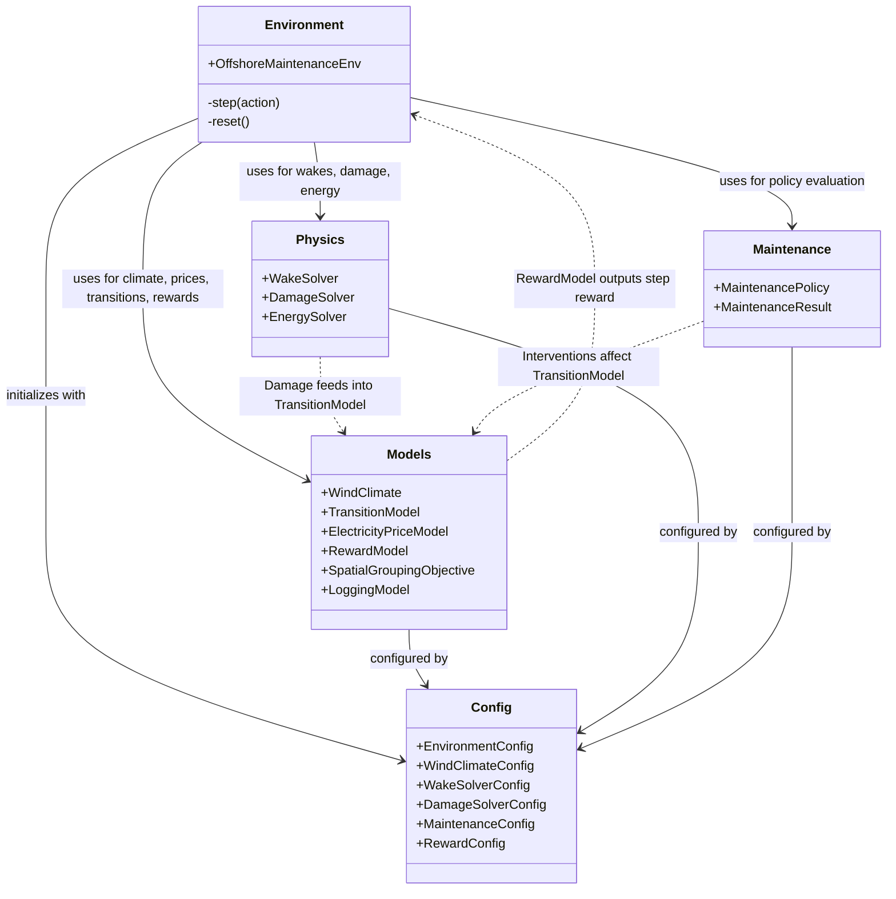

# Whisper Env

Whisper Env is a modular Python package for modeling an offshore wind farm maintenance environment. It provides a highly configurable framework for simulating wind climates, turbine damage accumulation, maintenance interventions, and energy production, ultimately designed for reinforcement learning (RL) agents or heuristic optimization.

## Project Overview

The project simulates an offshore maintenance scenario by coupling:
- **Wind Climate:** Stochastically samples ambient wind speed and direction, with a constraint on deterministic joint-probability stratified sampling to ensure robust fatigue damage evaluation.
- **Physics Modeling:** Includes a Wake Solver to compute effective wind speeds and turbulence intensities, a Damage Solver to accumulate fatigue damage based on structural response surfaces, and an Energy Solver.
- **Maintenance Policy:** Handles intervention decisions (e.g., repairs or replacements), integrating constraints such as thresholds, downtime, costs, carbon emissions, and damage multipliers.
- **RL Environment:** Wraps the simulation in a `gymnasium.Env` compliant interface (`OffshoreMaintenanceEnv`).

### Key Scientific Constraint: Fatigue Damage Sampling
The project enforces a critical scientific constraint in its wind sampling logic. The `iter_stratified` method in `whisper_env/models.py` strictly uses **deterministic joint-probability Stratified Sampling**. This approach is required to calculate expected fatigue damage and avoid **Jensen's Inequality bias**. Random sampling (e.g., `rng.choice`) for fatigue aggregation is strictly prohibited. By integrating over discrete probability strata instead of relying on limited random samples, the simulation ensures mathematical stability and accuracy in accumulated damage and power outputs.

## Installation

Whisper Env can be installed locally via pip.

```bash
git clone <repository_url>
cd <repository_directory>
pip install -e .
```

The package manages dependencies such as `gymnasium`, `py_wake`, `numpy`, `pandas`, and `xarray` through `pyproject.toml`. Note that testing and execution require this local installation.

## Architecture & Module Interaction

The following Mermaid diagram visualizes the interaction between the core modules within the `whisper_env` package.

*Note: While `rewards.py` might be expected, reward and objective logic are modularized within `models.py` (e.g., `RewardModel`, `SpatialGroupingObjective`) and `config.py`.*



## Running Tests

Unit tests are managed via `pytest`. To run the test suite:

```bash
python3 -m pytest tests/
```
